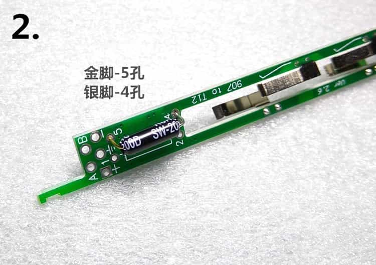

# T12焊台

### 参考网址

原作者easyEda：[https://easyeda.com/wagiminator/z-solderingstation-smd-v2](https://easyeda.com/wagiminator/z-solderingstation-smd-v2)

github原项目地址：[https://github.com/wagiminator/ATmega-Soldering-Station](https://github.com/wagiminator/ATmega-Soldering-Station)

中文固件开发者：[https://github.com/createskyblue/ATmega-Soldering-Station](https://github.com/createskyblue/ATmega-Soldering-Station)

用Arduino烧录bootloader和固件教程：

[http://blog.sina.com.cn/s/blog_6f72ff900102xktj.html](http://blog.sina.com.cn/s/blog_6f72ff900102xktj.html)

[https://www.bilibili.com/video/BV1Sf4y167eS](https://www.bilibili.com/video/BV1Sf4y167eS)

[https://www.arduino.cn/forum.php？mod=viewthread&tid=100378&page=1&extra=#pid573426](https://www.arduino.cn/forum.php?mod=viewthread&tid=100378&page=1&extra=#pid573426)

[https://www.bilibili.com/video/BV1mt4y1i7GE](https://www.bilibili.com/video/BV1mt4y1i7GE)

[https://www.bilibili.com/video/BV1fy4y1y78x/](https://www.bilibili.com/video/BV1fy4y1y78x/)

b站参考视频：

[https://www.bilibili.com/video/BV1RD4y127BJ](https://www.bilibili.com/video/BV1RD4y127BJ)

[https://www.bilibili.com/video/BV1hU4y1h7u2](https://www.bilibili.com/video/BV1hU4y1h7u2)

[https://www.bilibili.com/video/BV1w7411W75V](https://www.bilibili.com/video/BV1w7411W75V)

[https://www.bilibili.com/video/BV1iE41137xJ](https://www.bilibili.com/video/BV1iE41137xJ)

### 需要额外购买的零件(BOM除外)

- 手柄套件
- 3D打印盒子
- 航空插 (GX12  4芯)
- DC 电源插座 (5.5 * 2.1 mm)
- DC电源适配器 (15V)
- 两脚开关 (KCD1 15 * 10 mm)（焊接开关的时候开关一定要处于断开状态，不然开关会被烫坏）
- 线 (截面积0.75m㎡)
- 4 个螺丝 (1.7 * 12 )
- OLED屏幕 (128x64    4个引脚,引脚要GND开头)
- 贴片编码器

### 硬件

手柄部分：

另外一种手柄的接法

白色的线接金色引脚

焊台部分：

### 固件

1、Arduino的IDE安装u8glib库和PID_v1等其他需要的库(可以直接在IDE中下载导入，也可以直接把库文件拖进ArduinoIDE的libraries文件夹中)

2、连接(ArduinoUNO连上 电脑 和 T12控制板的ICSP)

3、新建ArduinoISP项目

先编译然后上传

4、点击烧录引导程序(bootloader)，到T12的主控(ATMEGA328P)中，成功之后关掉这个项目

5、烧录固件

打开T12的源码，先点击编译，然后点击使用编程器上传，成功之后T12焊台的屏幕会被点亮

